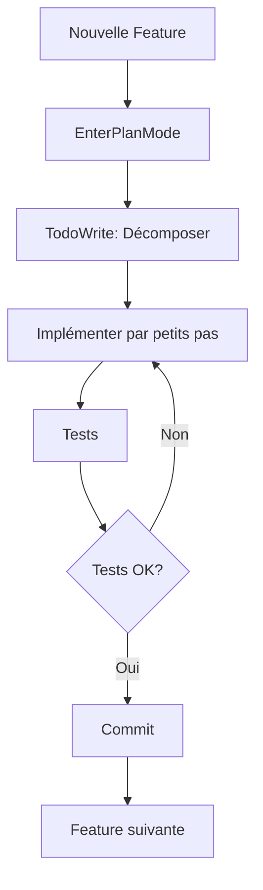
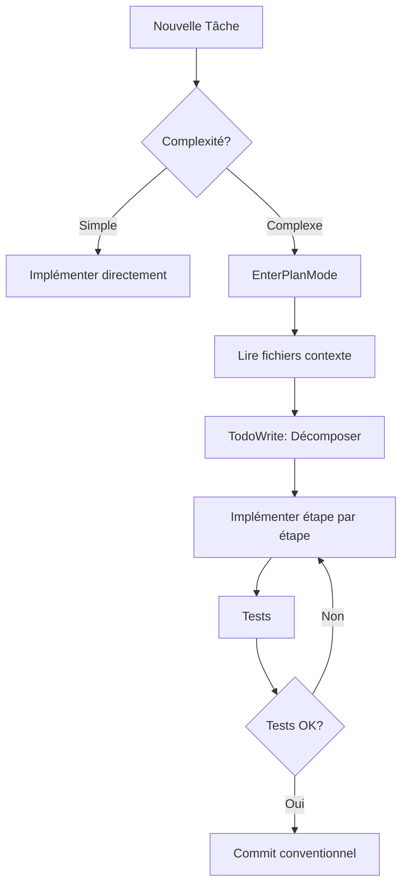

# 🚀 Package de Démarrage - Application Scalable et Robuste

> Guide complet pour développer une application moderne de A à Z avec Claude Code

## 📋 Table des Matières

1. [Vue d'ensemble](#vue-densemble)
2. [Phase 1 : Planification et Architecture](#phase-1-planification-et-architecture)
3. [Phase 2 : Développement Itératif](#phase-2-développement-itératif)
4. [Phase 3 : Qualité et Robustesse](#phase-3-qualité-et-robustesse)
5. [Phase 4 : Sécurité](#phase-4-sécurité)
6. [Phase 5 : Performance et Scalabilité](#phase-5-performance-et-scalabilité)
7. [Phase 6 : Tests et Validation](#phase-6-tests-et-validation)
8. [Phase 7 : Documentation](#phase-7-documentation)
9. [Phase 8 : Déploiement](#phase-8-déploiement)

---

## Vue d'ensemble

Ce package contient tous les outils, templates, checklists et configurations nécessaires pour démarrer un nouveau projet de manière professionnelle et scalable.

### Contenu du Package

```
startup-package/
├── README.md                          # Ce fichier
├── docs/                              # Documentation détaillée
│   ├── 01-PLANNING.md                # Phase de planification
│   ├── 02-DEVELOPMENT.md             # Développement itératif
│   ├── 03-QUALITY.md                 # Qualité du code
│   ├── 04-SECURITY.md                # Sécurité
│   ├── 05-PERFORMANCE.md             # Performance
│   ├── 06-TESTING.md                 # Tests
│   ├── 07-DOCUMENTATION.md           # Documentation
│   ├── 08-DEPLOYMENT.md              # Déploiement
│   ├── agents/                       # 🆕 Agents IA (Antigravity, Claude Code)
│   │   └── ANTIGRAVITY_GUIDE.md     # Guide complet pour agents IA
│   ├── legal/                        # Documentation juridique
│   │   ├── GDPR_GUIDE.md            # Guide complet RGPD
│   │   └── GDPR_IMPLEMENTATION.md   # Implémentation technique
│   ├── security/                     # Auth & Sécurité avancée
│   │   ├── SECRETS_MANAGEMENT.md    # Gestion des secrets
│   │   ├── PAYMENT_DATA_SECURITY.md # Données de paiement (PCI-DSS)
│   │   ├── PERSONAL_DATA_PROTECTION.md # Données personnelles
│   │   ├── KEYCLOAK_GUIDE.md        # Intégration Keycloak
│   │   ├── RBAC_GUIDE.md            # Role-Based Access Control
│   │   ├── JWT_OAUTH_GUIDE.md       # JWT et OAuth 2.0
│   │   └── FRONTEND_SECURITY_GUIDE.md # XSS, CSRF, CSP
│   ├── mobile-first/                 # Mobile-First & PWA
│   │   ├── MOBILE_FIRST_GUIDE.md    # Guide responsivité
│   │   └── PWA_GUIDE.md             # Guide PWA complet
│   ├── devops/                       # 🆕 CI/CD & DevOps complet
│   │   ├── CI_CD_GUIDE.md           # Guide complet CI/CD
│   │   ├── BRANCHING_STRATEGY.md    # GitFlow, Trunk-Based
│   │   ├── ENVIRONMENTS_GUIDE.md    # Dev, Staging, Production
│   │   ├── MONITORING_ROLLBACK_GUIDE.md # Monitoring & Rollback
│   │   ├── JENKINS_GUIDE.md         # 🆕 Guide Jenkins complet
│   │   ├── DOCKER_GUIDE.md          # 🆕 Docker & Docker Compose
│   │   ├── CODE_QUALITY_GUIDE.md    # 🆕 SonarQube & Fortify
│   │   └── PROMETHEUS_GRAFANA_GUIDE.md # 🆕 Monitoring avancé
│   ├── internationalization/         # 🆕 Internationalisation
│   │   └── I18N_GUIDE.md            # Multi-langue & Multi-devise
│   ├── standards/                    # 🆕 Standards Enterprise
│   │   └── ENTERPRISE_STANDARDS.md  # Bonnes pratiques grands groupes
│   └── saas/                         # 🆕 SaaS Multi-Tenant
│       └── MULTI_TENANT_GUIDE.md    # Guide complet multi-tenant
├── templates/                         # Templates réutilisables
│   ├── project-structure/            # Structure de dossiers
│   ├── configs/                      # Fichiers de configuration
│   ├── components/                   # Composants de base
│   │   ├── gdpr/                    # 🆕 Composants RGPD
│   │   │   ├── CookieBanner.tsx     # Bannière de cookies
│   │   │   ├── PrivacyCenter.tsx    # Centre de confidentialité
│   │   │   └── index.ts             # Exports
│   │   ├── pwa/                     # 🆕 Composants PWA
│   │   │   ├── PWAProvider.tsx      # Provider PWA complet
│   │   │   ├── InstallPrompt.tsx    # Prompt d'installation
│   │   │   ├── OfflineIndicator.tsx # Indicateur hors-ligne
│   │   │   ├── UpdatePrompt.tsx     # Prompt de mise à jour
│   │   │   └── index.ts             # Exports
│   │   └── responsive/              # 🆕 Composants responsive
│   │       ├── hooks.ts             # Hooks responsive
│   │       ├── components.tsx       # Composants layout
│   │       └── index.ts             # Exports
│   │   └── auth/                    # 🆕 Composants Auth
│   │       ├── AuthProvider.tsx     # Provider NextAuth + RBAC
│   │       ├── ProtectedRoute.tsx   # Protection de routes
│   │       └── index.ts             # Exports
│   ├── security/                     # 🆕 Middlewares sécurité
│   │   └── middleware.ts            # Middleware Next.js sécurisé
│   ├── devops/                       # 🆕 Templates CI/CD complets
│   │   ├── github-actions/          # Workflows GitHub Actions
│   │   │   ├── ci.yml               # Pipeline CI complet
│   │   │   ├── cd.yml               # Pipeline CD multi-env
│   │   │   └── rollback.yml         # Workflow de rollback
│   │   ├── jenkins/                 # 🆕 Templates Jenkins
│   │   │   └── Jenkinsfile          # Pipeline Jenkins complet
│   │   └── docker/                  # 🆕 Templates Docker
│   │       ├── Dockerfile           # Multi-stage build Next.js
│   │       ├── docker-compose.yml   # Dev environment
│   │       └── docker-compose.prod.yml # Production config
│   ├── checklists/                   # Checklists
│   ├── legal/                        # 🆕 Templates juridiques
│   │   ├── PRIVACY_POLICY_TEMPLATE.md
│   │   ├── TERMS_OF_SERVICE_TEMPLATE.md
│   │   ├── COOKIE_POLICY_TEMPLATE.md
│   │   └── LEGAL_NOTICES_TEMPLATE.md
│   ├── security/                     # 🆕 Utilitaires sécurité
│   │   └── encryption.ts            # Chiffrement AES-256-GCM
│   ├── agents/                       # 🆕 Templates agents IA
│   │   ├── AGENT.md.template        # Template AGENT.md/CLAUDE.md
│   │   ├── config.yml               # Configuration agent
│   │   └── prompts/                 # Templates de prompts
│   │       ├── feature.md           # Nouvelle feature
│   │       ├── bugfix.md            # Correction de bug
│   │       ├── refactor.md          # Refactoring
│   │       └── review.md            # Code review
│   └── saas/                         # 🆕 Templates SaaS Multi-Tenant
│       ├── prisma-schema.prisma     # Schéma DB multi-tenant
│       ├── tenant-middleware.ts     # Middleware identification tenant
│       ├── stripe-service.ts        # Service facturation Stripe
│       └── rbac-config.ts           # Configuration RBAC
├── scripts/                          # Scripts utilitaires
│   └── init-antigravity.sh          # 🆕 Initialisation agent IA
└── examples/                         # Exemples concrets
```

### Comment utiliser ce package

1. **Pour un nouveau projet** : Copiez la structure complète et suivez les phases dans l'ordre
2. **Pour un projet existant** : Utilisez les checklists et adaptez progressivement
3. **Avec Claude Code** : Référencez ce package dans vos conversations

---

## Démarrage Rapide

### Étape 1 : Copier le package dans votre nouveau projet

```bash
# Cloner ou copier ce dossier
cp -r startup-package /chemin/vers/nouveau-projet/
cd /chemin/vers/nouveau-projet
```

### Étape 2 : Suivre les phases

Chaque phase est documentée dans le dossier `docs/`. Commencez toujours par la Phase 1.

### Étape 3 : Utiliser avec Claude Code

Lors de vos conversations avec Claude Code, référencez le fichier de phase approprié :

```
"Je démarre un nouveau projet. Suis les instructions dans startup-package/docs/01-PLANNING.md"
```

---

## Philosophie du Package

### Principes Fondamentaux

1. **Simplicité avant tout** : N'ajoutez que ce qui est nécessaire maintenant
2. **Itératif** : Construisez par petites étapes validables
3. **Documentation vivante** : Le code doit être auto-documenté
4. **Sécurité dès le départ** : Intégrez la sécurité dès la conception
5. **Tests continus** : Testez au fur et à mesure, pas à la fin
6. **Performance par défaut** : Optimisez dès la conception
7. **Privacy by Design** : Conformité RGPD intégrée dès le début
8. **Mobile-First** : Conception pour mobile d'abord, puis adaptation desktop
9. **PWA par défaut** : Application installable et fonctionnelle hors-ligne

### Workflow Recommandé avec Claude Code



---

## Technologies Recommandées

Ce package est agnostique mais optimisé pour :

### Frontend
- **Framework** : Next.js 14+ (App Router)
- **Langage** : TypeScript (strict mode)
- **Styling** : Tailwind CSS
- **Validation** : Zod
- **State Management** : React Context / Zustand
- **Forms** : React Hook Form

### Backend
- **API** : Next.js API Routes / tRPC
- **Database** : PostgreSQL / Prisma ORM
- **Auth** : NextAuth.js / Clerk
- **Validation** : Zod

### DevOps
- **Hosting** : Vercel / Railway
- **Database** : Supabase / Neon
- **Monitoring** : Sentry
- **Analytics** : Vercel Analytics

---

## 🔒 Conformité RGPD/GDPR

Ce package inclut tout le nécessaire pour la conformité RGPD :

### Documentation
- **[GDPR_GUIDE.md](docs/legal/GDPR_GUIDE.md)** : Guide complet (principes, droits, obligations)
- **[GDPR_IMPLEMENTATION.md](docs/legal/GDPR_IMPLEMENTATION.md)** : Guide technique d'implémentation

### Templates Juridiques
- **Politique de confidentialité** : `templates/legal/PRIVACY_POLICY_TEMPLATE.md`
- **CGU** : `templates/legal/TERMS_OF_SERVICE_TEMPLATE.md`
- **Politique de cookies** : `templates/legal/COOKIE_POLICY_TEMPLATE.md`
- **Mentions légales** : `templates/legal/LEGAL_NOTICES_TEMPLATE.md`

### Composants React
```tsx
// Bannière de cookies
import { CookieBanner } from '@/components/gdpr';

<CookieBanner
  policyVersion="1.0"
  privacyPolicyUrl="/privacy"
  cookiePolicyUrl="/cookies"
/>

// Centre de confidentialité
import { PrivacyCenter } from '@/components/gdpr';

<PrivacyCenter
  userEmail={user.email}
  companyName="Ma Société"
  companyEmail="privacy@masociete.com"
/>

// Hook pour vérifier le consentement
import { useCookieConsent } from '@/components/gdpr';

const { hasConsent } = useCookieConsent();
if (hasConsent('analytics')) {
  initAnalytics();
}
```

### Checklist RGPD Rapide
- [ ] Pages légales créées (CGU, Confidentialité, Cookies, Mentions)
- [ ] Bannière de cookies conforme (opt-in)
- [ ] Centre de confidentialité accessible
- [ ] Export de données fonctionnel
- [ ] Suppression de compte disponible
- [ ] Registre des traitements documenté
- [ ] Logs d'audit en place

---

## 🔐 Sécurité des Données Sensibles

Ce package inclut une documentation complète pour protéger les données sensibles :

### Documentation Sécurité
- **[SECRETS_MANAGEMENT.md](docs/security/SECRETS_MANAGEMENT.md)** : Gestion des clés API, tokens, mots de passe
- **[PAYMENT_DATA_SECURITY.md](docs/security/PAYMENT_DATA_SECURITY.md)** : Protection cartes bancaires et IBAN (PCI-DSS)
- **[PERSONAL_DATA_PROTECTION.md](docs/security/PERSONAL_DATA_PROTECTION.md)** : Chiffrement des données personnelles

### Utilitaires de Chiffrement
```typescript
import { encrypt, decrypt, maskIBAN, maskEmail } from '@/lib/crypto/encryption';

// Chiffrer un IBAN (AES-256-GCM)
const encryptedIBAN = encrypt('FR7612345678901234567890189');

// Déchiffrer
const iban = decrypt(encryptedIBAN);

// Masquer pour affichage
maskIBAN('FR7612345678901234567890189');  // 'FR76 **** **** 0189'
maskEmail('john.doe@example.com');         // 'jo***@example.com'
```

### Intégration Stripe (Paiements)
```typescript
// Utilisez Stripe Elements - JAMAIS de données de carte dans votre code
import { PaymentElement } from '@stripe/react-stripe-js';

// Les données de carte ne touchent jamais votre serveur
<PaymentElement />
```

### Checklist Sécurité
- [ ] Variables d'environnement validées (Zod)
- [ ] Secrets dans Vercel/Vault (jamais dans le code)
- [ ] git-secrets ou équivalent configuré
- [ ] IBAN/données sensibles chiffrées (AES-256-GCM)
- [ ] Stripe Elements pour les paiements
- [ ] Logs sans données sensibles
- [ ] Rate limiting implémenté
- [ ] HTTPS obligatoire (HSTS)

---

## 📱 Mobile-First & PWA

Ce package adopte une approche **Mobile-First par défaut** avec PWA activée :

### Documentation
- **[MOBILE_FIRST_GUIDE.md](docs/mobile-first/MOBILE_FIRST_GUIDE.md)** : Guide complet de responsivité
- **[PWA_GUIDE.md](docs/mobile-first/PWA_GUIDE.md)** : Guide PWA (Service Worker, Installation, Offline)

### Philosophie Mobile-First

```css
/* ❌ Desktop-First (à éviter) */
.element { width: 1200px; }
@media (max-width: 768px) { .element { width: 100%; } }

/* ✅ Mobile-First (recommandé) */
.element { width: 100%; }
@media (min-width: 768px) { .element { width: 1200px; } }
```

### Hooks Responsive
```tsx
import { useBreakpoint, useOrientation, useSwipe } from '@/components/responsive';

function MyComponent() {
  const { isMobile, isTablet, isDesktop } = useBreakpoint();
  const { isPortrait } = useOrientation();

  return isMobile ? <MobileLayout /> : <DesktopLayout />;
}
```

### Composants Layout
```tsx
import { Container, Grid, Stack, Show, Hide } from '@/components/responsive';

<Container maxWidth="lg">
  <Grid cols={{ base: 1, md: 2, lg: 3 }} gap={4}>
    <Card />
    <Card />
    <Card />
  </Grid>

  <Show above="md">
    Visible uniquement sur tablette et desktop
  </Show>
</Container>
```

### PWA Provider (Activé par défaut)
```tsx
// app/layout.tsx
import { PWAProvider } from '@/components/pwa';

export default function RootLayout({ children }) {
  return (
    <html>
      <body>
        <PWAProvider
          installPromptDelay={30000}
          showOfflineIndicator
          showUpdatePrompt
        >
          {children}
        </PWAProvider>
      </body>
    </html>
  );
}
```

### Utilisation du Hook PWA
```tsx
import { usePWA } from '@/components/pwa';

function MyComponent() {
  const { isOnline, isInstalled, promptInstall } = usePWA();

  return (
    <div>
      {!isOnline && <OfflineBanner />}
      {!isInstalled && (
        <button onClick={promptInstall}>Installer l'app</button>
      )}
    </div>
  );
}
```

### Configuration PWA (Désactivable)
```env
# .env.local - Désactiver PWA si besoin
NEXT_PUBLIC_PWA_ENABLED=false
```

### Checklist Mobile-First & PWA
- [ ] Design mobile-first (min-width media queries)
- [ ] Touch targets >= 44px
- [ ] Safe areas gérées (notch, home indicator)
- [ ] Manifest.json configuré
- [ ] Service Worker actif
- [ ] Icônes PWA générées (192x192, 512x512)
- [ ] Mode hors-ligne fonctionnel
- [ ] Prompt d'installation configuré
- [ ] Score Lighthouse PWA > 90

---

## 🔐 Authentification & Sécurité Avancée

Ce package inclut une solution complète d'authentification et de sécurité enterprise-grade :

### Documentation

- **[KEYCLOAK_GUIDE.md](docs/security/KEYCLOAK_GUIDE.md)** : Intégration Keycloak (IAM)
- **[RBAC_GUIDE.md](docs/security/RBAC_GUIDE.md)** : Role-Based Access Control
- **[JWT_OAUTH_GUIDE.md](docs/security/JWT_OAUTH_GUIDE.md)** : JWT et OAuth 2.0 sécurisé
- **[FRONTEND_SECURITY_GUIDE.md](docs/security/FRONTEND_SECURITY_GUIDE.md)** : Protection XSS, CSRF, CSP

### Keycloak (Identity Provider)

```bash
# Démarrer Keycloak avec Docker
docker run -p 8080:8080 \
  -e KEYCLOAK_ADMIN=admin \
  -e KEYCLOAK_ADMIN_PASSWORD=admin \
  quay.io/keycloak/keycloak:latest start-dev
```

```typescript
// Configuration NextAuth avec Keycloak
import NextAuth from 'next-auth';
import KeycloakProvider from 'next-auth/providers/keycloak';

export default NextAuth({
  providers: [
    KeycloakProvider({
      clientId: process.env.KEYCLOAK_CLIENT_ID!,
      clientSecret: process.env.KEYCLOAK_CLIENT_SECRET!,
      issuer: process.env.KEYCLOAK_ISSUER,
    }),
  ],
});
```

### RBAC (Role-Based Access Control)

```tsx
// Utilisation du AuthProvider
import { AuthProvider, useAuth, Can } from '@/components/auth';

// Dans app/layout.tsx
<AuthProvider>
  {children}
</AuthProvider>

// Dans vos composants
function AdminPanel() {
  const { user, hasRole, hasPermission } = useAuth();

  return (
    <>
      <Can permission="users:create">
        <CreateUserButton />
      </Can>

      <Can roles={['admin', 'manager']}>
        <AdminMenu />
      </Can>
    </>
  );
}
```

### Protection de Routes

```tsx
import { ProtectedRoute, RequireAuth } from '@/components/auth';

// Protection avec permissions
<ProtectedRoute
  permissions={['dashboard:view']}
  redirectTo="/unauthorized"
>
  <Dashboard />
</ProtectedRoute>

// Protection simple (authentification requise)
<RequireAuth loginUrl="/login">
  <UserProfile />
</RequireAuth>
```

### Middleware de Sécurité

```typescript
// middleware.ts
import { createSecurityMiddleware } from '@/lib/security/middleware';

export default createSecurityMiddleware({
  protectedRoutes: {
    '/admin': { roles: ['admin'] },
    '/api/users': { permissions: ['users:read'], rateLimit: 100 },
  },
  publicRoutes: ['/', '/auth', '/api/auth'],
  securityHeaders: true,
});

export const config = {
  matcher: ['/((?!_next/static|_next/image|favicon.ico).*)'],
};
```

### Protection API Routes

```typescript
// app/api/users/route.ts
import { protectApi } from '@/lib/security/middleware';

export const GET = protectApi(
  async (request, { user }) => {
    const users = await getUsers();
    return NextResponse.json(users);
  },
  { permissions: ['users:read'], rateLimit: 100 }
);

export const POST = protectApi(
  async (request, { user }) => {
    const data = await request.json();
    return NextResponse.json(await createUser(data), { status: 201 });
  },
  { permissions: ['users:create'], rateLimit: 10 }
);
```

### Protection XSS et CSRF

```typescript
// Service de sanitization
import { sanitize, sanitizeObject } from '@/lib/security/sanitization';

// Sanitizer les entrées utilisateur
const safeHtml = sanitize(userInput);
const safeData = sanitizeObject(formData);

// Validation Zod avec sanitization
const userSchema = z.object({
  name: z.string().transform(sanitize),
  email: z.string().email(),
  bio: z.string().transform(sanitize),
});
```

```tsx
// Protection CSRF automatique
import { useCSRF, SecureForm } from '@/components/security';

function MyForm() {
  const { csrfToken, headers } = useCSRF();

  return (
    <SecureForm action="/api/submit" method="POST">
      {/* Token CSRF inclus automatiquement */}
      <input name="data" />
      <button type="submit">Envoyer</button>
    </SecureForm>
  );
}
```

### Headers de Sécurité (CSP, HSTS, etc.)

```typescript
// Automatiquement ajoutés par le middleware
// - X-Frame-Options: DENY
// - X-Content-Type-Options: nosniff
// - X-XSS-Protection: 1; mode=block
// - Referrer-Policy: strict-origin-when-cross-origin
// - Strict-Transport-Security (en production)
// - Content-Security-Policy (avec nonce)
```

### Checklist Auth & Sécurité

- [ ] Keycloak configuré (realm, client, utilisateurs)
- [ ] NextAuth.js intégré avec Keycloak
- [ ] RBAC implémenté (rôles, permissions)
- [ ] Routes protégées (middleware + composants)
- [ ] API Routes sécurisées (protectApi)
- [ ] Rate limiting actif
- [ ] Sanitization XSS (DOMPurify)
- [ ] Protection CSRF (tokens + SameSite cookies)
- [ ] Headers de sécurité configurés
- [ ] JWT avec refresh token rotation
- [ ] Audit logs en place

---

## 🚀 CI/CD & DevOps

Ce package inclut une solution complète pour automatiser vos déploiements :

### Documentation

- **[CI_CD_GUIDE.md](docs/devops/CI_CD_GUIDE.md)** : Guide complet CI/CD (GitHub Actions, GitLab CI)
- **[BRANCHING_STRATEGY.md](docs/devops/BRANCHING_STRATEGY.md)** : Stratégies de branches (GitFlow, Trunk-Based, GitHub Flow)
- **[ENVIRONMENTS_GUIDE.md](docs/devops/ENVIRONMENTS_GUIDE.md)** : Gestion des environnements (dev, staging, prod)
- **[MONITORING_ROLLBACK_GUIDE.md](docs/devops/MONITORING_ROLLBACK_GUIDE.md)** : Monitoring et procédures de rollback

### Templates GitHub Actions

```yaml
# Copier les templates dans .github/workflows/
cp templates/devops/github-actions/*.yml .github/workflows/
```

### Pipeline CI

```yaml
# .github/workflows/ci.yml
name: CI Pipeline

on:
  push:
    branches: [main, develop]
  pull_request:
    branches: [main, develop]

jobs:
  lint:       # ESLint, Prettier, TypeScript
  unit-tests: # Jest avec couverture
  e2e-tests:  # Playwright
  build:      # Next.js build
  security:   # Trivy, npm audit
```

### Pipeline CD

```yaml
# .github/workflows/cd.yml
name: CD Pipeline

on:
  push:
    branches: [main]

jobs:
  build:              # Build de l'application
  deploy-staging:     # Auto-deploy sur staging
  e2e-staging:        # Tests E2E sur staging
  deploy-production:  # Deploy prod (avec approbation)
  verify:             # Smoke tests post-deploy
```

### Rollback d'Urgence

```yaml
# Déclencher manuellement via GitHub Actions
gh workflow run rollback.yml \
  -f environment=production \
  -f reason="High error rate detected"
```

### Environnements

```
┌─────────────────────────────────────────────────────────────┐
│  LOCAL       PREVIEW       STAGING        PRODUCTION       │
│  localhost   pr-123.app    staging.app    app.com         │
│                                                             │
│  ───────▶    ───────▶      ───────▶       ───────▶        │
│   commit       PR           merge           approval       │
└─────────────────────────────────────────────────────────────┘
```

### Feature Flags

```typescript
import { useFeatureFlag, Feature } from '@/lib/feature-flags';

// Hook
const showNewDashboard = useFeatureFlag('newDashboard');

// Composant
<Feature flag="betaSearch" fallback={<OldSearch />}>
  <BetaSearch />
</Feature>
```

### Monitoring

```typescript
// Sentry pour les erreurs
import * as Sentry from '@sentry/nextjs';
Sentry.captureException(error);

// Health check endpoint
// GET /api/health
{
  "status": "healthy",
  "version": "1.2.3",
  "checks": {
    "database": { "status": "pass" },
    "redis": { "status": "pass" }
  }
}
```

### Stratégies de Branches

| Stratégie | Utilisation | Complexité |
|-----------|-------------|------------|
| **GitHub Flow** | Petites équipes, SaaS | Simple |
| **Trunk-Based** | CI/CD mature, DevOps | Simple |
| **GitFlow** | Releases planifiées, Apps mobiles | Complexe |

### Checklist CI/CD

- [ ] Pipeline CI configuré (lint, tests, build)
- [ ] Pipeline CD configuré (staging, production)
- [ ] Environnements GitHub configurés
- [ ] Secrets configurés (VERCEL_TOKEN, etc.)
- [ ] Branch protection activée
- [ ] Preview deployments fonctionnels
- [ ] Smoke tests post-deploy
- [ ] Monitoring en place (Sentry, Datadog)
- [ ] Health checks configurés
- [ ] Procédure de rollback documentée
- [ ] Alertes configurées (Slack, PagerDuty)

---

## 🐳 Jenkins, Docker & Analyse de Code

Ce package inclut des outils enterprise-grade pour CI/CD avancé :

### Documentation DevOps Avancée

- **[JENKINS_GUIDE.md](docs/devops/JENKINS_GUIDE.md)** : Guide Jenkins complet (pipelines, shared libraries, Docker)
- **[DOCKER_GUIDE.md](docs/devops/DOCKER_GUIDE.md)** : Docker & Docker Compose (multi-stage, production)
- **[CODE_QUALITY_GUIDE.md](docs/devops/CODE_QUALITY_GUIDE.md)** : SonarQube & Fortify SAST
- **[PROMETHEUS_GRAFANA_GUIDE.md](docs/devops/PROMETHEUS_GRAFANA_GUIDE.md)** : Monitoring avancé

### Templates Jenkins & Docker

```bash
# Copier les templates
cp templates/devops/jenkins/Jenkinsfile ./Jenkinsfile
cp templates/devops/docker/* ./
```

### Pipeline Jenkins

```groovy
// Jenkinsfile - Pipeline complet
pipeline {
    agent any
    stages {
        stage('Quality Checks') { ... }    // Lint, TypeCheck
        stage('Unit Tests') { ... }        // Jest + Coverage
        stage('SonarQube') { ... }         // Analyse de code
        stage('Build Docker') { ... }      // Multi-stage build
        stage('Deploy Staging') { ... }    // Auto-deploy
        stage('Deploy Production') { ... } // Avec approbation
    }
}
```

### Docker Multi-Stage

```dockerfile
# Dockerfile optimisé pour production
FROM node:20-alpine AS base
FROM base AS deps        # Dependencies
FROM base AS builder     # Build Next.js
FROM node:20-alpine AS runner  # Image finale légère
```

### Docker Compose

```yaml
# docker-compose.yml - Stack complète
services:
  app:        # Next.js
  postgres:   # Database
  redis:      # Cache
  prometheus: # Métriques
  grafana:    # Dashboards
```

### SonarQube Integration

```bash
# Lancer l'analyse SonarQube
npm run sonar

# Quality Gates
# - Coverage > 80%
# - Duplications < 3%
# - 0 vulnérabilités critiques
# - 0 bugs bloquants
```

### Prometheus & Grafana

```typescript
// Métriques application
import { httpRequestsTotal, httpRequestDuration } from '@/lib/metrics';

// API endpoint /api/metrics pour Prometheus
export async function GET() {
  const metrics = await register.metrics();
  return new Response(metrics, {
    headers: { 'Content-Type': register.contentType }
  });
}
```

### Checklist DevOps Avancé

- [ ] Jenkins installé et configuré
- [ ] Jenkinsfile créé avec tous les stages
- [ ] Dockerfile multi-stage optimisé
- [ ] Docker Compose pour dev et prod
- [ ] SonarQube configuré
- [ ] Quality Gates définis
- [ ] Prometheus scraping les métriques
- [ ] Dashboards Grafana créés
- [ ] Alertes configurées

---

## 🌍 Internationalisation (i18n) & Multi-Currency

Ce package inclut un guide complet pour les applications internationales :

### Documentation

- **[I18N_GUIDE.md](docs/internationalization/I18N_GUIDE.md)** : Guide complet i18n et multi-devises

### Configuration i18n

```typescript
// i18n/config.ts
export const i18nConfig = {
  locales: ['en', 'fr', 'es', 'de', 'ar', 'zh-Hans', 'ja', 'pt-BR'],
  defaultLocale: 'en',
  namespaces: ['common', 'auth', 'dashboard', 'errors'],
};
```

### Utilisation des traductions

```tsx
// Hook de traduction
import { useTranslation } from '@/hooks/useTranslation';

function MyComponent() {
  const { t } = useTranslation();
  return <h1>{t('dashboard.title')}</h1>;
}
```

### Formatage localisé

```typescript
// Dates, nombres, devises
import { useFormatter } from '@/hooks/useFormatter';

const { date, number, currency } = useFormatter();

date.short(new Date());        // "12/31/2024" (en) / "31/12/2024" (fr)
number.standard(1234.56);      // "1,234.56" (en) / "1 234,56" (fr)
currency.format(99.99, 'EUR'); // "€99.99" (en) / "99,99 €" (fr)
```

### Multi-Currency

```typescript
import { useCurrency } from '@/hooks/useCurrency';

const { format, convert, setCurrency } = useCurrency();

// Formater
format(100);              // "$100.00" (si USD)

// Convertir
convert(100, 'EUR', 'USD'); // 108.50 (taux actuel)

// Changer la devise
setCurrency('EUR');
```

### Support RTL (Arabe, Hébreu)

```tsx
// Layout automatique RTL
<html lang="ar" dir="rtl">
  <body className="rtl:text-right">
    {children}
  </body>
</html>
```

### SEO International

```typescript
// Métadonnées multilingues
export async function generateMetadata({ params }) {
  return {
    alternates: {
      languages: {
        'en': '/en',
        'fr': '/fr',
        'de': '/de',
      },
    },
  };
}
```

### Checklist i18n

- [ ] Locales configurées
- [ ] Fichiers de traduction créés
- [ ] Formatters date/number/currency
- [ ] Support RTL si nécessaire
- [ ] hreflang pour SEO
- [ ] Détection automatique de locale
- [ ] Persistance préférence utilisateur

---

## 🏢 Standards Enterprise

Ce package inclut les meilleures pratiques des grandes entreprises :

### Documentation

- **[ENTERPRISE_STANDARDS.md](docs/standards/ENTERPRISE_STANDARDS.md)** : Standards de développement enterprise

### Standards Couverts

| Domaine | Standards |
|---------|-----------|
| **Code** | ESLint strict, TypeScript strict, SonarQube |
| **Architecture** | DDD, CQRS, Hexagonal, Microservices |
| **Tests** | Pyramide de tests, 80% coverage, E2E |
| **Sécurité** | OWASP Top 10, Zero Trust, SOC2 |
| **DevOps** | GitOps, ArgoCD, Feature Flags |
| **Monitoring** | OpenTelemetry, SLO/SLI/SLA |
| **Documentation** | ADRs, OpenAPI, TypeDoc |
| **Conformité** | GDPR, PCI-DSS, ISO 27001 |

### Principes Clés

```
┌────────────────────────────────────────┐
│           PRINCIPES ENTERPRISE          │
├────────────────────────────────────────┤
│ • Fiabilité: 99.99% uptime, DR < 1h    │
│ • Scalabilité: Horizontal scaling      │
│ • Sécurité: Zero Trust, Security by Design │
│ • Maintenabilité: Clean Code, SOLID    │
└────────────────────────────────────────┘
```

### Configuration ESLint Enterprise

```javascript
// .eslintrc.js - Strict mode
{
  plugins: ['@typescript-eslint', 'security', 'sonarjs'],
  rules: {
    '@typescript-eslint/no-explicit-any': 'error',
    'sonarjs/cognitive-complexity': ['error', 15],
    'security/detect-object-injection': 'warn',
    'max-lines-per-function': ['warn', { max: 50 }],
    'complexity': ['error', 10],
  }
}
```

### Checklist Enterprise

- [ ] ESLint strict configuré
- [ ] TypeScript strict mode
- [ ] Quality gates définis
- [ ] Architecture hexagonale
- [ ] CQRS si complexité élevée
- [ ] OpenTelemetry tracing
- [ ] SLO/SLI définis
- [ ] ADRs documentés
- [ ] Code review obligatoire
- [ ] Conformité GDPR/SOC2

---

## 🏢 SaaS Multi-Tenant

Ce package inclut un guide complet pour construire une plateforme SaaS multi-tenant :

### Documentation

- **[MULTI_TENANT_GUIDE.md](docs/saas/MULTI_TENANT_GUIDE.md)** : Guide complet multi-tenant

### Stratégies d'Isolation des Données

| Stratégie | Description | Recommandé pour |
|-----------|-------------|-----------------|
| **Pool (tenant_id)** | Colonne tenant_id sur chaque table | Startups, SaaS à grande échelle ⭐ |
| **Bridge (Schema)** | Un schéma DB par tenant | Moyennes entreprises |
| **Silo (Database)** | Une base de données par tenant | Grandes entreprises, données sensibles |

### Architecture Multi-Tenant

```
┌─────────────────────────────────────────────────────────┐
│                    APPLICATION                           │
├─────────────────────────────────────────────────────────┤
│  ┌─────────────────────────────────────────────────┐   │
│  │           TENANT CONTEXT LAYER                   │   │
│  │  Middleware → Context → Provider → Repository    │   │
│  └─────────────────────────────────────────────────┘   │
├─────────────────────────────────────────────────────────┤
│   Tenant A    │    Tenant B    │    Tenant C           │
│   (Salon 1)   │    (Salon 2)   │    (Salon 3)          │
└─────────────────────────────────────────────────────────┘
```

### Identification du Tenant

```typescript
// Subdomain: salon1.app.com → tenant = "salon1"
// Path: app.com/salon1/... → tenant = "salon1"
// Header: X-Tenant-ID header

// middleware.ts
export async function middleware(request: NextRequest) {
  const subdomain = request.headers.get('host')?.split('.')[0];
  const tenant = await resolveTenant(subdomain);

  if (!tenant) {
    return NextResponse.redirect('/404');
  }

  // Injecter le tenant dans les headers
  const response = NextResponse.next();
  response.headers.set('x-tenant-id', tenant.id);
  return response;
}
```

### Schéma Prisma Multi-Tenant

```prisma
model Client {
  id        String   @id @default(cuid())
  tenantId  String   // ← Clé d'isolation
  tenant    Tenant   @relation(fields: [tenantId], references: [id])

  name      String
  email     String?

  @@index([tenantId])           // Index pour les performances
  @@unique([tenantId, email])   // Unicité par tenant
}
```

### Plans et Limites

```typescript
const PLAN_LIMITS = {
  FREE: { maxUsers: 1, maxClients: 50, maxApiCalls: 1000 },
  STARTER: { maxUsers: 5, maxClients: 500, maxApiCalls: 10000 },
  PROFESSIONAL: { maxUsers: 25, maxClients: 5000, maxApiCalls: 100000 },
  ENTERPRISE: { maxUsers: -1, maxClients: -1, maxApiCalls: -1 }, // Illimité
};
```

### Intégration Stripe

```typescript
// Création d'abonnement
const subscription = await stripe.subscriptions.create({
  customer: tenant.stripeCustomerId,
  items: [{ price: priceId }],
  metadata: { tenant_id: tenant.id },
});

// Webhook pour synchroniser le statut
async function handleWebhook(event: Stripe.Event) {
  if (event.type === 'customer.subscription.updated') {
    await updateTenantSubscription(event.data.object);
  }
}
```

### RBAC Multi-Tenant

```typescript
// Rôles par tenant
enum TenantRole {
  OWNER = 'owner',       // Propriétaire (facturation, suppression)
  ADMIN = 'admin',       // Administration complète
  MANAGER = 'manager',   // Gestion RDV et clients
  EMPLOYEE = 'employee', // Ses propres RDV uniquement
  VIEWER = 'viewer',     // Lecture seule
}

// Vérification de permission
function hasPermission(role: TenantRole, permission: string): boolean {
  return ROLE_PERMISSIONS[role].includes(permission);
}
```

### Templates Disponibles

```bash
# Copier les templates
cp templates/saas/prisma-schema.prisma prisma/schema.prisma
cp templates/saas/tenant-middleware.ts src/middleware.ts
cp templates/saas/stripe-service.ts src/services/stripe.ts
cp templates/saas/rbac-config.ts src/config/rbac.ts
```

### Checklist SaaS Multi-Tenant

- [ ] Stratégie d'isolation choisie (Pool recommandé)
- [ ] tenant_id sur toutes les tables métier
- [ ] Index composites créés
- [ ] Middleware d'identification du tenant
- [ ] RBAC multi-tenant configuré
- [ ] Plans et limites définis
- [ ] Stripe intégré (customers, subscriptions)
- [ ] Webhooks Stripe configurés
- [ ] Rate limiting par tenant
- [ ] Audit logging par tenant
- [ ] Monitoring et métriques par tenant

---

## 🤖 Agents IA (Antigravity / Claude Code)

Ce package inclut une intégration complète pour les agents de développement IA :

### Documentation

- **[ANTIGRAVITY_GUIDE.md](docs/agents/ANTIGRAVITY_GUIDE.md)** : Guide complet pour Antigravity et Claude Code

### Agents Supportés

| Agent | Description | Fichier Config |
|-------|-------------|----------------|
| **Antigravity** | Agent Claude (VSCode) | `AGENT.md` |
| **Claude Code** | CLI officiel Anthropic | `CLAUDE.md` |
| **Cursor** | IDE avec IA intégrée | `.cursorrules` |
| **Aider** | CLI open-source | `CONVENTIONS.md` |

### Démarrage Rapide

```bash
# Nouveau projet
./startup-package/scripts/init-antigravity.sh new mon-projet

# Projet existant
cd mon-projet
../startup-package/scripts/init-antigravity.sh migrate
```

### Structure Générée

```
mon-projet/
├── AGENT.md                    # 📋 Instructions pour l'agent
├── .antigravity/               # Configuration
│   ├── config.yml              # Comportements, outils, hooks
│   ├── prompts/                # Templates de prompts
│   └── memory/                 # Mémoire persistante
└── docs/
    └── adr/                    # Architecture Decision Records
```

### Fichier AGENT.md

Le fichier `AGENT.md` (ou `CLAUDE.md`) fournit le contexte à l'agent IA :

```markdown
# AGENT.md - Instructions pour l'Agent de Développement

## 📋 Informations Projet
- **Nom** : Mon Application
- **Stack** : Next.js 14 + TypeScript + Tailwind CSS
- **Architecture** : Hexagonale

## 🎯 Règles Impératives
### TOUJOURS
- Utiliser TypeScript strict mode
- Valider les inputs avec Zod
- Utiliser TodoWrite pour décomposer les tâches

### JAMAIS
- Utiliser `any` en TypeScript
- Accéder directement au localStorage depuis les composants
- Committer sans tests

## 🏗️ Architecture
[Structure des dossiers et conventions...]
```

### Configuration Agent

```yaml
# .antigravity/config.yml
context:
  always_include:
    - "AGENT.md"
    - "package.json"
    - "tsconfig.json"

  exclude:
    - "node_modules/**"
    - ".next/**"
    - "*.log"

behaviors:
  planning:
    use_todo_list_threshold: 3
    enter_plan_mode_for: ["feature", "refactor", "architecture"]

  coding:
    read_before_edit: true
    validate_typescript: true
    max_file_length: 300

hooks:
  pre_commit:
    - "npm run lint"
    - "npm run type-check"
```

### Templates de Prompts

Le package inclut des templates de prompts pour différents workflows :

```bash
# Nouvelle feature
cat templates/agents/prompts/feature.md

# Correction de bug
cat templates/agents/prompts/bugfix.md

# Refactoring
cat templates/agents/prompts/refactor.md

# Code review
cat templates/agents/prompts/review.md
```

### Workflow Recommandé



### Utilisation avec Claude Code

```bash
# Exemple de conversation avec Claude Code
claude "Je veux ajouter l'authentification. Suis les instructions dans AGENT.md"

# Avec un template de prompt
claude < .antigravity/prompts/feature.md
```

### Mémoire Persistante

L'agent peut conserver des informations entre les sessions :

```yaml
# .antigravity/memory/patterns.yml
learned_patterns:
  - pattern: "Tous les composants utilisent Tailwind"
    confidence: 0.95
  - pattern: "Les tests sont dans __tests__/"
    confidence: 0.90

project_knowledge:
  main_entry: "app/page.tsx"
  test_command: "npm test"
  build_command: "npm run build"
```

### Checklist Agent IA

- [ ] AGENT.md créé avec informations projet
- [ ] Règles TOUJOURS/JAMAIS définies
- [ ] Architecture documentée
- [ ] Commands disponibles listées
- [ ] config.yml configuré
- [ ] Templates de prompts personnalisés
- [ ] Hooks pre-commit configurés
- [ ] .gitignore mis à jour

---

## Prochaines Étapes

1. Lisez [docs/01-PLANNING.md](docs/01-PLANNING.md)
2. Remplissez le questionnaire de planification
3. Utilisez les checklists fournies
4. **Configurez l'agent IA** (voir [docs/agents/ANTIGRAVITY_GUIDE.md](docs/agents/ANTIGRAVITY_GUIDE.md))
5. Implémentez la conformité RGPD (voir [docs/legal/GDPR_GUIDE.md](docs/legal/GDPR_GUIDE.md))
6. Configurez l'authentification (voir [docs/security/KEYCLOAK_GUIDE.md](docs/security/KEYCLOAK_GUIDE.md))
7. Configurez le CI/CD (voir [docs/devops/CI_CD_GUIDE.md](docs/devops/CI_CD_GUIDE.md))
8. Configurez Jenkins et Docker (voir [docs/devops/JENKINS_GUIDE.md](docs/devops/JENKINS_GUIDE.md))
9. Implémentez l'i18n si nécessaire (voir [docs/internationalization/I18N_GUIDE.md](docs/internationalization/I18N_GUIDE.md))
10. Appliquez les standards enterprise (voir [docs/standards/ENTERPRISE_STANDARDS.md](docs/standards/ENTERPRISE_STANDARDS.md))
11. **Configurez le multi-tenant** si SaaS (voir [docs/saas/MULTI_TENANT_GUIDE.md](docs/saas/MULTI_TENANT_GUIDE.md))
12. Commencez l'implémentation phase par phase

---

## Contribution et Amélioration

Ce package est évolutif. Ajoutez vos propres pratiques et patterns au fur et à mesure.

### Structure pour vos ajouts personnels

```
startup-package/
└── custom/
    ├── my-patterns/
    ├── my-configs/
    └── my-checklists/
```

---

## License

MIT - Libre d'utilisation et de modification

---

## Support

Pour toute question sur l'utilisation de ce package avec Claude Code, référencez simplement ce README dans votre conversation.

**Bonne construction ! 🚀**
